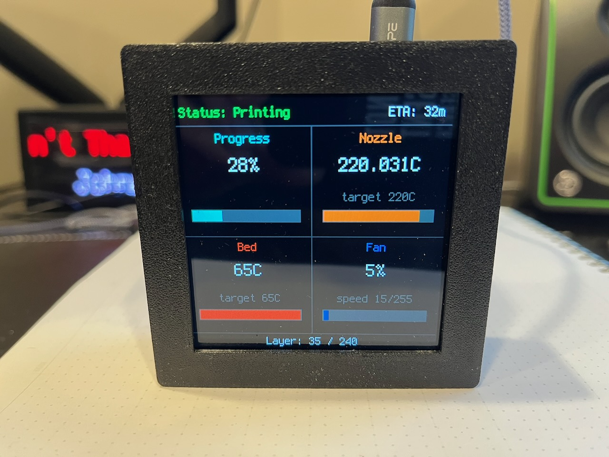

 

# CircuitBambu
Monitor your Bambu Labs 3D printer using CircuitPython

CircuitBambu requires the `circuitpyhon-bambulabs` library.  This library returns the JSON information from your printer in an easy to use format allowing you to build a user interface for your microcontroller and display like the one below. To install via circup:

`circup install bambulabs`

## Example

`qualia.py` includes an example built on the [circuitpython-bambulabs library](https://github.com/prcutler/CircuitPython_bambulabs/).

## MQTT Credentials

You can connect to your Bambu Labs printer locally or via Bambu Cloud (recommended).

To access your credentials:

1. Login to [MakerWorld](https://makerworld.com/)
2. Open the `dev-tools` (F12 in most browsers) and select `Application > Cookies > https://makerworld.com`
3. Copy the `token` string and save as `BAMBU_ACCESS_TOKEN` in `settings.toml`
4. Access [/api/v1/design-user-service/my/preference](https://makerworld.com/api/v1/design-user-service/my/preference) and copy `uid` as `USER_ID`
5. Access [/api/v1/iot-service/api/user/bind](https://makerworld.com/api/v1/iot-service/api/user/bind) and copy your `dev_id` as `DEVICE_ID`
6. Connect to the MQTT server with the following information.
  URL: `mqtt://us.mqtt.bambulab.com:8883`
  TLS: YES
  Authentication: required
  Username: u_{USER_ID}
  Password: {ACCESS_TOKEN}
> Warning: The subscribe topics must be fully specified
- `device/{DEVICE_ID}/report`
- `device/{DEVICE_ID}/request`

# References

Documentation adapted from a [gist by syuchan10005](https://gist.github.com/syuchan1005/9aee026ff77cf9745950de188b26346c)
https://github.com/Doridian/OpenBambuAPI/blob/main/mqtt.md
https://github.com/Doridian/OpenBambuAPI/blob/main/cloud-http.md
